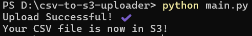

# CSV → S3 Uploader (Python + AWS + boto3) 🚀

**Pravin Kumar — Cloud & Python Learner**  
GitHub: https://github.com/pravinkumar-hash
LinkedIn:https://www.linkedin.com/in/pravin-kumar-aa735924a

---

## Project Summary
A beginner-friendly cloud automation that uploads local CSV files to an AWS S3 bucket using Python and the `boto3` SDK.  
This project demonstrates secure credential handling, fundamentals of AWS S3 and IAM, and simple automation — all key skills for entry-level Cloud / DevOps roles.

---

## Why this matters 
- Shows practical **hands-on AWS experience** (S3, IAM, AWS CLI).  
- Demonstrates **automation using Python** and AWS SDK (`boto3`).  
- Documents security-aware practices (no hard-coded keys; use AWS CLI).  
- Includes runnable code, screenshots, and clear steps — ready to demo in interviews.

---

## Demo (screenshots)
  

---

## Features / What I built
- Read a local CSV and upload to a specified S3 bucket.  
- Uses `boto3` for S3 interactions.  
- Handles common errors (file not found, credential issues).  
- Secure credentials via AWS CLI (`aws configure`) — **no keys in code**.  
- Well-documented with runnable instructions and screenshots.

---

## Tech stack
- Language: Python 3.x  
- AWS services: S3, IAM  
- Libraries: `boto3`  
- Tools: AWS CLI, Git, GitHub

---

## Project structure

csv-to-s3-uploader/
├─ main.py
├─ sample.csv
├─ requirements.txt
├─ .gitignore
├─ s3_upload_screenshot.png
├─ cmd_upload_success.png
└─ README.md

